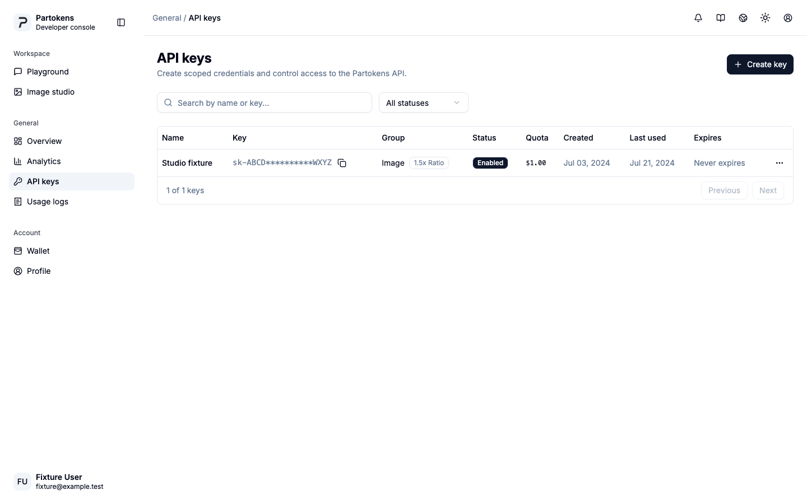
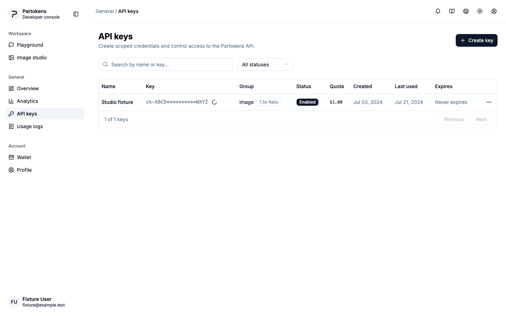
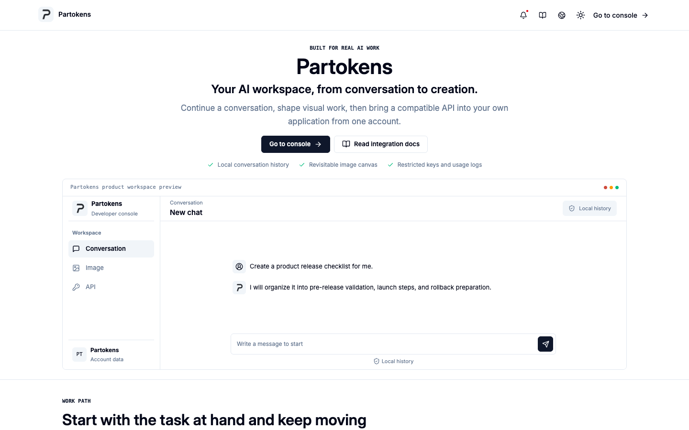
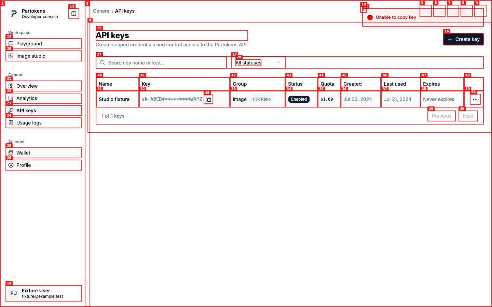

# Dogfood Report: Partokens API Key Copy Race

| Field | Value |
|-------|-------|
| **Date** | 2026-08-24 |
| **App URL** | http://127.0.0.1:43199/en/console/keys |
| **Session** | partokens-key-copy-ce3f62d91bab |
| **Scope** | API key copy under a delayed reveal response followed by immediate tab or route switching |

## Summary

| Severity | Count |
|----------|-------|
| Critical | 0 |
| High | 0 |
| Medium | 1 |
| Low | 0 |
| **Total** | **1** |

## Issues

### ISSUE-001: Delayed one-click copy fails after the API Keys tab loses focus

| Field | Value |
|-------|-------|
| **Severity** | medium |
| **Category** | functional / ux |
| **URL** | http://127.0.0.1:43199/en/console/keys |
| **Repro Video** | N/A: the local agent-browser install could not encode video because `ffmpeg` is unavailable; step screenshots and the browser exception are included instead. |

**Description**

The list copy control does not have the full key when the user clicks it. It first sends `POST /api/token/7/key` and calls the Clipboard API only after the response arrives. With a five-second delayed response, switching to another browser tab before the response returns causes the eventual clipboard call to run from a hidden, unfocused document. Chromium rejects it with `NotAllowedError: Failed to execute 'writeText' on 'Clipboard': Document is not focused.` The clipboard retains its previous contents while the failure toast remains in the original tab.

This is not a general failure of Partokens client-side route navigation. As a control, navigating from API Keys to Analytics in the same focused browser tab still completed the delayed clipboard write. A full document navigation can still destroy the pending JavaScript request and has the same user-visible failure as leaving the tab.

**Repro Steps**

1. Open the API Keys page with the reveal endpoint delayed by five seconds.
   

2. Click `Copy key Studio fixture`; the button enters its pending state while the reveal request is in flight.
   

3. Switch to another browser tab before the delayed response returns.
   

4. Return to API Keys. The page reports `Unable to copy key`, and the instrumented Clipboard call records `visibility: hidden`, `focus: false`, and `NotAllowedError: Document is not focused`.
   

**Recommendation**

Start the Clipboard operation from the original click instead of waiting to call it after the network response. Where supported, pass a delayed `Blob` promise to `ClipboardItem` and call `navigator.clipboard.write(...)` synchronously from the user gesture. The same Chromium scenario completed successfully even though the payload resolved while the document was hidden. Feature-detect this path and fall back to the existing reveal dialog, where the user makes a second explicit Copy click after the key has loaded. Do not prefetch or persist full keys merely to make copying synchronous.
