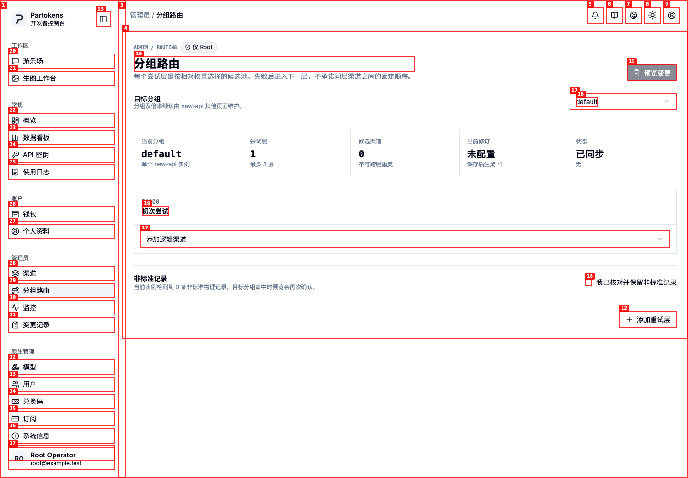
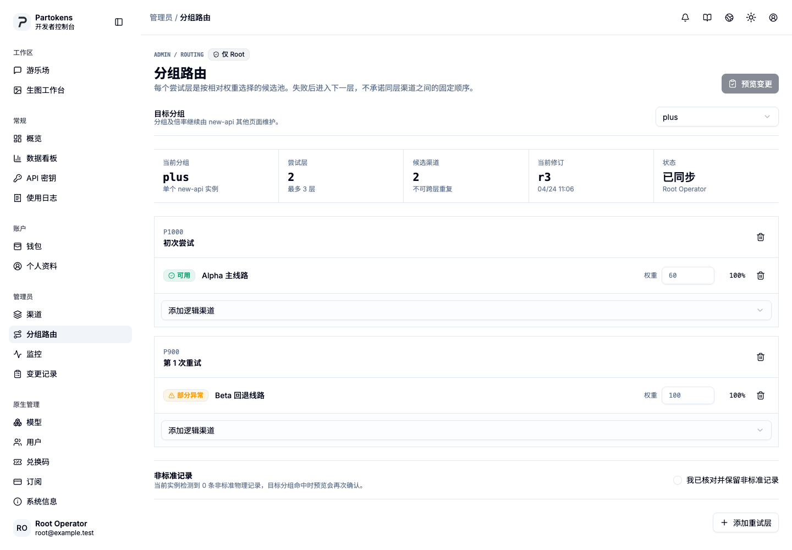
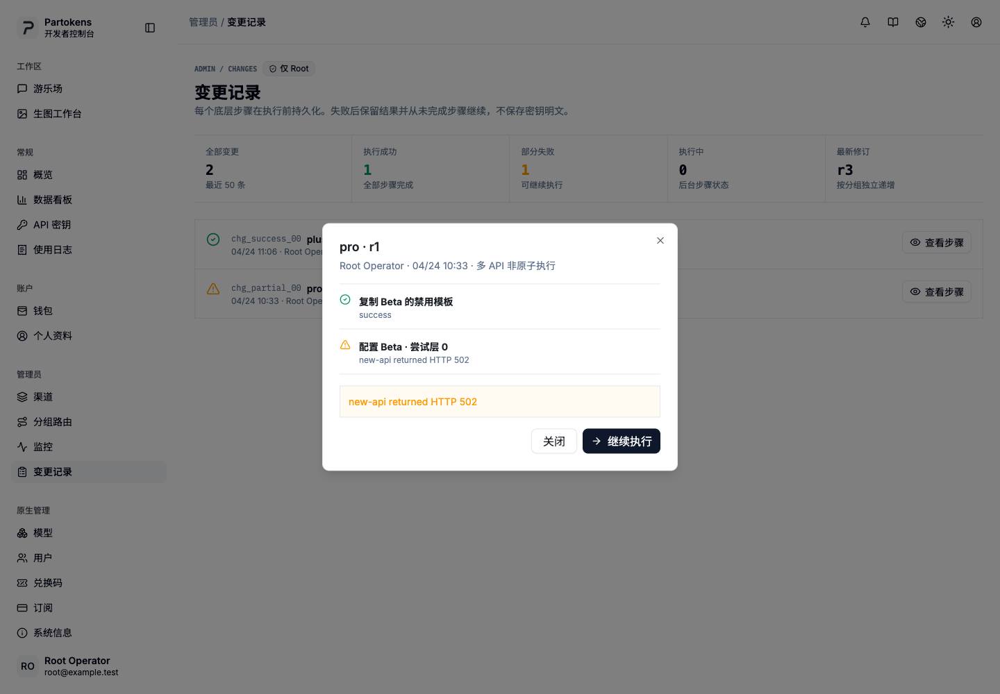
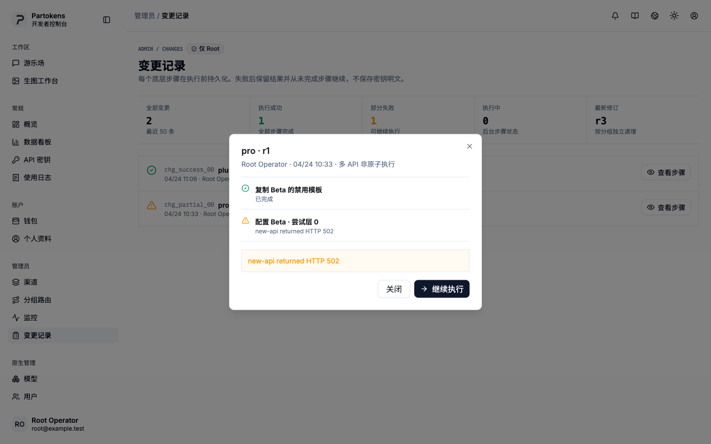

# Dogfood Report: Partokens Root Channel Operations

| Field | Value |
|-------|-------|
| **Date** | 2026-08-25 |
| **App URL** | http://127.0.0.1:5174/zh-CN/console/admin/channels |
| **Session** | partokens-admin-qa |
| **Scope** | Root channel, routing, monitoring, and change workspaces; desktop/mobile and light/dark |

## Summary

| Severity | Count |
|----------|-------|
| Critical | 0 |
| High | 0 |
| Medium | 1 |
| Low | 1 |
| **Total** | **2** |
| **Resolved** | **2** |
| **Open** | **0** |

## Issues

### ISSUE-001: Existing route is hidden behind the first alphabetical group

| Field | Value |
|-------|-------|
| **Severity** | medium |
| **Category** | ux |
| **URL** | http://127.0.0.1:5174/zh-CN/console/admin/routes |
| **Repro Video** | N/A |
| **Status** | Resolved |

**Description**

The instance has a saved `plus` route at revision 3, but the route workspace
opens `default`, the first group returned by the API. The empty editor and
"unconfigured" metric can make an operator believe no route exists. The first
saved route should be selected before falling back to the first available group.

**Repro Steps**

1. Open the route workspace for an instance whose first saved route is `plus`
   while `default` is the first available group.
2. Observe that `default` is selected and the existing revision is not shown.
   

**Resolution**

The initial selection now prefers the first saved route that is still present
in the instance groups, then falls back to the first available group. The
workspace opens `plus` and shows revision `r3`.

---

### ISSUE-002: Completed step leaks the backend status enum into the Chinese UI

| Field | Value |
|-------|-------|
| **Severity** | low |
| **Category** | content |
| **URL** | http://127.0.0.1:5174/zh-CN/console/admin/changes |
| **Repro Video** | N/A |
| **Status** | Resolved |

**Description**

The partial-change dialog rendered the raw `success` API enum beneath a
completed step while the surrounding administrator interface is Simplified
Chinese.

**Repro Steps**

1. Open the change workspace and inspect a partial change.
2. Observe the English `success` state beneath the completed step.
   

**Resolution**

Step states now resolve through the administrator copy module. The same step
is displayed as `已完成`, leaving an explicit seam for future locales.

---
