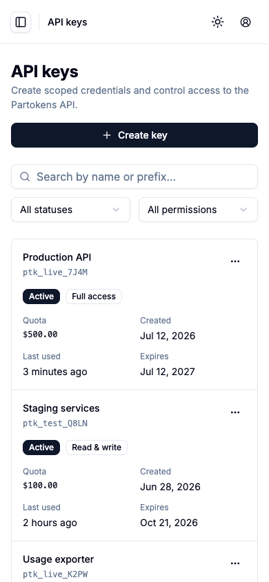
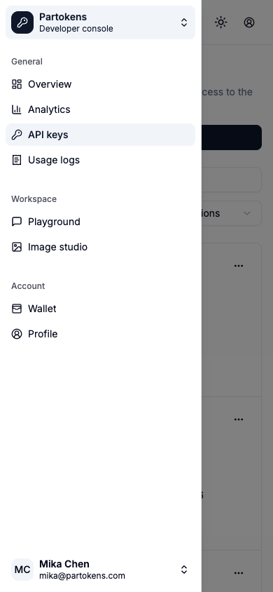
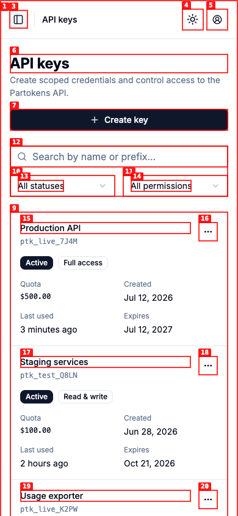
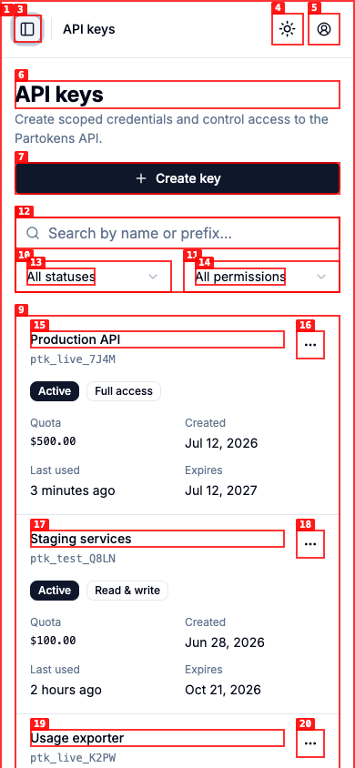

# Dogfood Report: Partokens API Keys

| Field | Value |
|-------|-------|
| **Date** | 2026-07-23 |
| **App URL** | http://127.0.0.1:4180/#console-keys |
| **Session** | r37-api-keys |
| **Scope** | API key management, desktop/mobile responsive behavior, and required interactions |

## Summary

| Severity | Count |
|----------|-------|
| Critical | 0 |
| High | 0 |
| Medium | 0 |
| Low | 1 |
| **Total** | **1** |

All recorded issues were resolved and re-tested in this run. Unresolved issues: 0.

## Issues

### ISSUE-001: Mobile sidebar does not restore focus to its trigger

| Field | Value |
|-------|-------|
| **Severity** | low |
| **Category** | accessibility |
| **Status** | resolved |
| **URL** | http://127.0.0.1:4180/#console-keys |
| **Repro Video** | unavailable: local ffmpeg is not installed |

**Description**

Pressing Escape closes the mobile sidebar, but focus moves to the page root instead of returning to the Toggle Sidebar button.

**Repro Steps**

1. Open the page at a 390px viewport.
   

2. Open the mobile sidebar.
   

3. Press Escape and observe that the menu trigger does not regain focus.
   

**Resolution**

The console header now restores focus to the mobile sidebar trigger after the Sheet close animation. The fixed state was verified with the trigger as `document.activeElement`.

