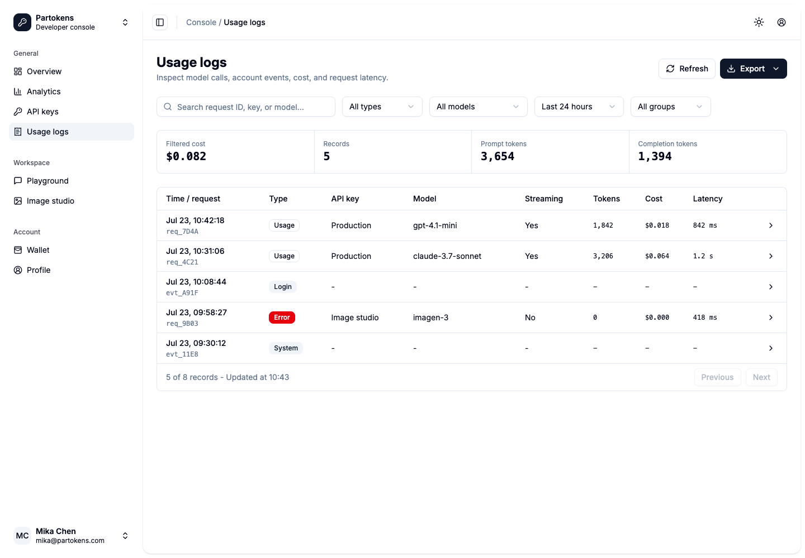

# Dogfood Report: Partokens Usage Logs

| Field | Value |
|-------|-------|
| **Date** | 2026-07-23 |
| **App URL** | http://127.0.0.1:4180/#console-logs |
| **Session** | r38-usage-logs |
| **Scope** | Usage log filtering, responsive layout, request details, feedback states, and route regression |

## Summary

| Severity | Count |
|----------|-------|
| Critical | 0 |
| High | 0 |
| Medium | 0 |
| Low | 1 |
| **Total** | **1** |

All recorded issues were resolved and re-tested in this run. Unresolved issues: 0.

## Issues

### ISSUE-001: Time range label is clipped at the desktop viewport

| Field | Value |
|-------|-------|
| **Severity** | low |
| **Category** | visual |
| **Status** | resolved |
| **URL** | http://127.0.0.1:4180/#console-logs |
| **Repro Video** | N/A - static issue |

**Description**

At 1440px, the time range Select rendered "Last 24 hou" instead of the complete "Last 24 hours" label.

**Repro Steps**

1. Open the usage logs page at a 1440px viewport.
   

2. Observe the clipped time range label in the filter row.

**Resolution**

The time range trigger width was increased to preserve the full label. The corrected Light and Dark states were verified at 1440px.

## Verification

- Select filters update the table, summary, Clear action, and empty state.
- Export Dropdown opens, closes with Escape, and returns focus to its trigger.
- Request details use Dialog on desktop and Sheet at 390px.
- Error records expose the upstream error code in an alert state.
- Refresh exposes a disabled Loading state and resolves to a success Toast.
- Disabled pagination controls remain non-interactive.
- Dialog, Sheet, and mobile Sidebar close with Escape and restore focus.
- 1440px Light and Dark screenshots show no clipping or overlap.
- At 390px, document, body, and viewport widths are all 390px.
- Browser console reports no errors.
- `#system`, `#console-keys`, `#console-analytics`, `#console-wallet`, and `#home` load successfully.
