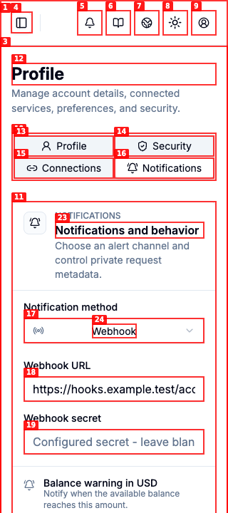
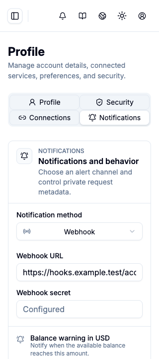

# Dogfood Report: Partokens R4.4 Account

| Field | Value |
|-------|-------|
| **Date** | 2026-08-07 |
| **App URL** | `http://127.0.0.1:4174` |
| **Sessions** | `r44-account`, `r44-design` |
| **Scope** | Wallet and Profile, Security, Connections, Notifications tasks |

## Summary

| Severity | Count |
|----------|-------|
| Critical | 0 |
| High | 0 |
| Medium | 0 |
| Low | 0 |
| **Total open** | **0** |

No open R4.4 issues remained after the final browser pass. The pass found and fixed the Profile tab mobile reflow and a clipped configured-secret placeholder at 320px.

## Visual Matrix

- Routes: Wallet, Profile, Security, Connections, Notifications.
- Viewports: `1440x900`, `1024x768`, `768x900`, `390x844`, `320x720`.
- Themes: light and dark.
- Evidence: 50 production screenshots paired with 50 design-lab screenshots in `screenshots/`.
- Narrow viewport result: no page-level horizontal overflow; the final Connections page measured `scrollWidth=320` at a `320px` viewport.
- Browser result: no page errors; the clean console pass contained only the development server connection and React DevTools information messages.

Representative pairs:

- [Wallet design, dark, 1440](screenshots/design-wallet-dark-1440.png) and [Wallet production, dark, 1440](screenshots/production-wallet-dark-1440.png)
- [Connections design, light, 320](screenshots/design-connections-light-320.png) and [Connections production, light, 320](screenshots/production-connections-light-320.png)
- [Notifications design, dark, 390](screenshots/design-notifications-dark-390.png) and [Notifications production, dark, 390](screenshots/production-notifications-dark-390.png)

Interaction evidence:

- [Top-up confirmation](screenshots/wallet-payment-dialog-1440.png)
- [2FA setup, desktop](screenshots/security-2fa-dialog-1440.png)
- [2FA setup, 320px](screenshots/security-2fa-dialog-320.png)
- [Access token confirmation](screenshots/security-token-dialog-1440.png)
- [Account deletion confirmation, 320px](screenshots/security-delete-dialog-320.png)
- [Connection disconnect confirmation](screenshots/connections-disconnect-dialog-1440.png)

## Automated Validation

- TypeScript: Web and Docs typechecks passed.
- Unit and contract tests: release contract `5/5`, Web `130/130`, Docs `3/3`.
- Account E2E: `8/8` passed after the responsive tabs and stored-secret corrections.
- Wallet critical flow: `1/1` passed with the semantic `Preset amounts` radiogroup.
- Production build: Web and Docs passed; Console bundle budgets passed.
- Account i18n: the seven-locale Account fallback tests passed.

## Residual Cross-Suite Risk

The earlier full E2E run passed `152/156`. The obsolete Wallet selector from that run is fixed and its migrated critical flow now passes. The remaining three failures are outside R4.4: a missing Auth hero AVIF, an expired OAuth visual fixture state, and the final Vietnamese Console locale-matrix timeout. They were not modified during this Account closeout.

## Issues

No reproducible open issues remain in the R4.4 Account scope.

### ISSUE-001: Configured-secret placeholder clips at 320px (resolved)

| Field | Value |
|-------|-------|
| **Severity** | low |
| **Category** | visual / content |
| **URL** | `http://127.0.0.1:4175/en/console/profile?tab=notifications` |
| **Repro Video** | N/A |

**Description**

The Webhook secret placeholder was longer than the 320px form control and clipped the final word. The stored secret itself remained absent from the input value and page text. The placeholder was shortened to a localized configured-state label without changing the design-lab layout.

**Repro Steps**

1. Open Notifications at a `320x720` viewport and inspect the Webhook secret field.
   

**Resolution evidence**

The localized short status fits at 320px without changing the form composition.

