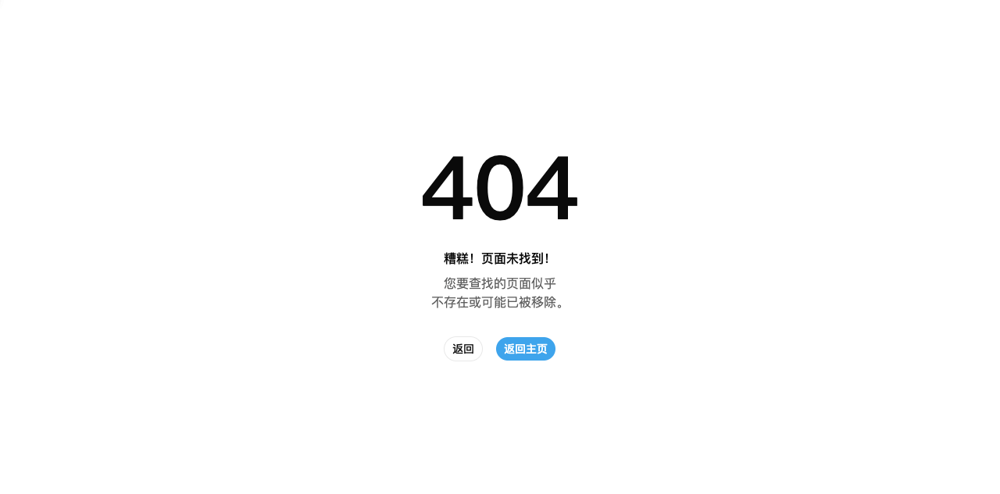

# R55.5 Console Deployment Final Closeout

| 字段 | 结果 |
| --- | --- |
| 日期 | 2026-07-28 |
| 范围 | staging/deployed Foundation UI 最终验收；restricted 四区域场景已移除 |
| Permission Gate | **FAILED / 仅 Deployment 阻塞** |
| R56 | **NOT APPROVED / 本轮未执行** |

## 结论

账户所有方已决定从 Permission Gate 移除“可登录但对 Overview、Analytics、Keys、Logs 返回真实 HTTP 403”的 restricted 场景。当前系统不提供这种账户类型，也不再要求为 R55/R56 实现或验收该能力。既有模拟 403 测试继续作为前端防御性契约覆盖，不构成 release Gate。

staging 仍不可解析。Production 四条 Foundation 路径虽然都返回 HTTP 200，但真实浏览器 H1 全部为 `404`；人工检查截图确认页面正文为本地化“页面未找到”，不是 deployed Foundation UI。

本轮没有创建、修改或删除任何 production Key 或其他业务资源，资源操作数量和最终残留均为 0。typecheck、unit、build 和完整 Chromium E2E 全部通过。restricted 条件移除后，Permission Gate 只剩部署 UI 一个硬阻塞；由于该条件仍未满足，**Permission Gate 继续失败，R56 canonical cutover 继续不批准**。

## 执行边界

- 没有重做 R55.3 owner/non-owner 权限矩阵。
- 没有展开或重做 R55.4 管理员页面验收；管理员账户只用于最小角色识别，命中既有 `/channels` 跳转后立即退出。
- 没有修改 canonical route、应用源码或测试源码。
- 没有注入 bearer、cookie、header 或角色字段。
- 没有保存 auth state、HAR、trace、录屏、响应正文或 credentialed screenshot。
- 没有记录账户身份、用户名、密码、用户 ID、SID、cookie、token、原始日志或敏感响应字段。

## 环境复核

| 环境 | 真实结果 | Gate 状态 |
| --- | --- | --- |
| Local Foundation | `http://127.0.0.1:4174` 可用，通过既有同源 `/api` production 代理建立真实登录 session | 可用 |
| Design Lab | `http://127.0.0.1:4180` 在完整 E2E 前后均保持监听 | 可用 |
| Staging | `staging.partokens.com`、`api-staging.partokens.com`、`staging-api.partokens.com`、`test.partokens.com` 均无 A/AAAA 地址 | **Blocked** |
| Production deployed UI | 四条 Foundation URL 均为 HTTP 200 包裹的真实 404 页面 | **Failed** |

## 已移除的 Restricted 场景

三组登录材料均从真实本地化登录页输入，并使用互不共享状态的 `agent-browser` session：

1. 第一组登录后请求既有 `/channels` 管理入口，说明仍是 R55.4 已验收的管理员账户。没有读取或操作管理页面；同源 cookie-only logout 返回 HTTP 200，随后关闭 session。
2. 第二组登录后进入 `/en/console-foundation/overview`，但不是 restricted 账户。页面冷启动的真实底层结果如下。
3. 新增第三组账户从真实登录页提交后，`POST /api/user/login` 返回 HTTP 200 业务失败。浏览器保留在 `/en/auth/sign-in`，显示与禁用状态一致的安全错误，未请求 `/api/user/auth/refresh`，也没有建立 session。

| Overview surface | 真实 transport | 页面结果 |
| --- | --- | --- |
| Token list | HTTP 200 | 无权限 alert |
| Log statistics | HTTP 200 | 无权限 alert |
| Log list | HTTP 200 | 无权限 alert |

普通用户 Overview 的三个底层接口均为 HTTP 200；新增账户则在登录阶段被禁用。这些观测说明当前 production 只有普通功能访问与登录级禁用边界，没有四区域功能级 restricted 角色。

新增账户属于登录级禁用边界，不是功能级 restricted 边界。登录失败发生在 AuthBundle/session 建立之前，因此无法导航到四个 Foundation 区域，也不存在“403 后保留当前 session、显示功能权限错误且不 refresh”的可验收前提。HTTP 200 业务登录失败不能替代真实 HTTP 403。

账户所有方已正式移除原 Gate 中的 restricted 场景。以下内容不再是 R55/R56 的缺失证据或退出条件：

- Overview token/log/stat 的真实功能级 403。
- Analytics usage/flow 的真实功能级 403。
- Keys list 的真实功能级 403。
- Logs list/stat 的真实功能级 403。
- 上述真实 403 下的 session 保留、安全权限错误投影和 0 refresh。

R55.3 的模拟 403 契约和本轮通过的对应 E2E 保留，用于保证后端偶发返回 403 时前端仍能安全处理。它们是防御性兼容覆盖，不代表产品存在或必须新增 restricted 角色。登录禁用错误也没有被解释为功能级 403。

## Deployed Foundation 验收

staging 不可用后，按要求回退到真实 production deployed UI 验收。

| 路径 | Transport | 真实浏览器 H1 | 判定 |
| --- | --- | --- | --- |
| `/en/console-foundation/overview` | HTTP 200 | `404` | 未部署 |
| `/en/console-foundation/analytics` | HTTP 200 | `404` | 未部署 |
| `/en/console-foundation/keys` | HTTP 200 | `404` | 未部署 |
| `/en/console-foundation/logs` | HTTP 200 | `404` | 未部署 |

Overview 匿名视觉证据：。该截图已人工检查，只包含匿名 404 页面，没有认证信息或敏感数据。

HTTP 200 仅证明传输成功，不能覆盖页面语义；四页均明确显示 `404`，所以 Deployment Gate 不通过。

## Session 与资源清理

| 检查 | 结果 |
| --- | --- |
| 隔离 session | deployed 匿名、管理员角色识别、普通用户探测均使用独立 session |
| 管理员识别 session | cookie-only logout HTTP 200，已关闭 |
| 普通用户探测 session | cookie-only logout HTTP 200；再次访问保护路由回到带安全 `redirect` 的本地化登录页 |
| 新增禁用账户 session | 登录被业务拒绝，没有建立 auth session；0 refresh，浏览器 session 已关闭 |
| Active browser session | 最终 `agent-browser session list` 为 0 |
| Auth state / HAR / trace / video | 未创建 |
| Production 业务资源 | 创建 0、修改 0、删除 0、残留 0 |
| 本地服务 | 4174 Web 与 4180 Design Lab 在回归结束后仍监听 |

本轮账户边界探测没有创建 Key 或执行任何 production 写操作，因此不需要资源删除；最终残留为 0。

## 自动化与回归

| 命令 | 最终结果 |
| --- | --- |
| `npm run typecheck` | 通过；web、docs，98 个本地化文档页面，0 文件更新 |
| `npm run test` | 通过；web 11 files / 74 tests，docs 1 file / 3 tests |
| `npm run build` | 通过；web、docs，docs 102 个静态页面 |
| `npm run test:e2e` | Chromium 95/95，1 worker，3.0 分钟，0 failures，`retries=0` |

Unit 输出一次既有 `--localstorage-file` 路径 warning；docs build 输出既有 `baseline-browser-mapping` 数据过期 warning，均未导致失败。

完整 E2E 会重写历史 screenshot 与 HTML report。本轮生成的 tracked artifact churn 已全部恢复到运行前状态；Reporter 清理的既有未跟踪 `dogfood-output/playwright-report/index 2.html` 也按 tracked baseline 恢复。所有用户既存源码修改、未跟踪目录和 `* 2` 文件均保留。

新增禁用账户是在上述完整回归后提供的。本次补测只增加真实浏览器登录边界证据，没有修改应用、测试或配置，因此没有重复运行同一套自动化；既有本轮完整回归结果保持有效。

## 修改范围

- `dogfood-output/r55-5-console-restricted-and-deployment-final-closeout/report.md`：本报告。
- `dogfood-output/r55-5-console-restricted-and-deployment-final-closeout/screenshots/production-foundation-overview.png`：匿名 production 404 视觉证据。

没有修改应用源码、测试源码或 canonical route，没有执行 R56。

## 安全检查

- 真实账户页面没有截图、录屏或 trace；唯一截图为匿名 production 404。
- 浏览器网络证据只记录 method、同源 API 路径和 HTTP status，没有读取或保存响应正文。
- 凭据、cookie、SID、bearer、完整 Key、原始日志、metadata、HAR、auth state 和敏感响应均未写入产物。
- 账户文件只按行数和不透明结构确认可用性，值未输出。
- 本报告不包含账户身份或角色字段原始响应。
- 两项 R55.5 产物对六条真实安全输入的精确匹配为 0。
- JWT、长 `sk-` 和 PEM private key 模式匹配为 0。
- `git diff --check` 与未跟踪报告的 whitespace 检查通过。

## Gate 与 R56 判断

**Permission Gate：FAILED / 仅 Deployment 阻塞。**

已通过或移除：三账户最小角色库存复核、新增禁用账户登录边界、restricted 四区域场景正式移出 Gate、session 清理、零 production 资源操作、完整回归。

唯一剩余阻塞：可用 staging 或真实 deployed Foundation UI。当前 staging 无可解析地址，production 四条 Foundation 路径仍是 HTTP 200 包裹的真实 404。

**R56 canonical cutover：NOT APPROVED。** 本轮没有执行 R56；`/$locale/console/*` 必须继续保持当前 canonical 承载，直到 Deployment 阻塞由真实环境证据关闭。
