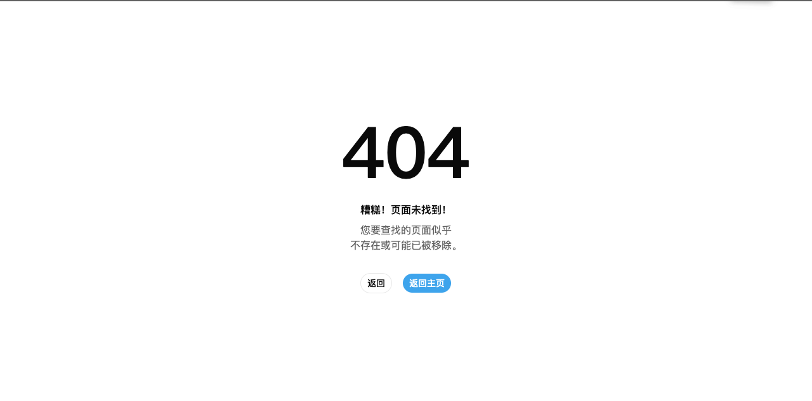

# R55.6 Console Deployment Final Closeout

| 字段 | 结果 |
| --- | --- |
| 日期 | 2026-07-28 |
| 范围 | Foundation 构建溯源、staging/production 发布状态、deployed UI 与完整回归 |
| Permission Gate | **FAILED / 仅 Deployment 阻塞** |
| R56 | **NOT APPROVED / 本轮未执行** |

## 当前结论

staging 候选域名仍不可解析，也没有可确认的 staging 安装目标。Production 四条 Foundation 路径虽然都是 HTTP 200，但真实 Chromium H1 全部为 `404`，并加载旧 New API Web 的 `/static/*` 资产；`/_ui/healthz` 同样没有命中 Foundation Caddy。

当前 Foundation 源码首次出现在 `origin/dev` 的 `d70d532`，但 R55.2/R55.3 后续认证契约仍处于未提交工作树；仓库 `release/` 又是 2026-07-21 的旧包且缺少 corresponding-source URL。因此本轮不存在可安全安装的、来源完整的 Foundation release，也没有已配置部署主机。未执行 staging 或 production 服务器变更。

typecheck、unit、build 最终通过，完整 Chromium E2E 最终在 1 worker、0 retry 下 95/95 通过；浏览器 session、临时服务与 production 业务资源残留均为 0。唯一硬阻塞仍是 deployed Foundation UI，以及依赖该 UI 的普通用户登录、刷新恢复和四页 smoke。**Permission Gate 不关闭，R56 不批准且未执行。**

## 执行边界

- 不重做 R55.3 owner/non-owner 权限矩阵或 R55.4 管理员验收。
- 不修改 canonical `/$locale/console/*`，不执行 R56。
- 不注入 bearer、cookie、header 或角色字段。
- 不保存 auth state、HAR、trace、响应正文、账户身份、用户名、密码、SID、cookie、token、完整 Key、原始日志或敏感响应字段。
- production 业务资源操作保持最小；本轮不创建、修改或删除 Key。

## Foundation 构建与发布溯源

| 项目 | 结果 |
| --- | --- |
| Foundation 首个远端提交 | `d70d5320edf0bc771ca8ce34aaf0845ff9321e98`，2026-07-27 23:29:20 +08:00，`origin/dev` |
| 当前工作树 | 基于 `d70d532`，包含尚未提交的 R55.2/R55.3 认证契约与测试改动，因此不是可引用的 deployed Git SHA |
| 当前本地 Web build | 2026-07-28 14:37:55 +08:00；`index.html` SHA-256 `b98800eebe58d0f5c63a26d409c758a0f850c914e959d46f86fb330d8cfb87e0`；入口资产 `/_ui/js/index.3ed1cf2cb9.js` |
| 仓库 `release/` | 2026-07-21 13:57:29 +08:00；`sourceCodeUrl=null`；New API `v1.0.0-rc.21`；不是当前 Foundation release |
| GitHub deployment 记录 | 公开仓库 API 返回 0 条 |
| 发布入口 | `deploy/README.md` 定义的自托管 Caddy 安装；仓库没有 Vercel/Netlify/Pages 发布配置 |
| staging 发布入口 | 未发现 DNS、仓库环境记录或本机已配置部署主机 |
| Production 当前链路 | New API `v1.0.0-rc.22`；旧 Web build marker `rv.0000.2k6e8r7p`；不是 Foundation build |

发布文档要求先公开完整对应源码，再生成带稳定 HTTPS `sourceCodeUrl` 的 release，并在目标主机切换 `/srv/partokens-ui/current`、验证 Caddy 后 reload。当前工作树和旧 `release/` 均不满足该前提；本机也没有 partokens staging/production 的 SSH 主机配置。为了避免发布不可追溯源码或猜测服务器，本轮没有生成伪 release、没有 push、没有修改 DNS/Caddy，也没有覆盖 production。

## 环境发布状态

| 环境 | 只读探测 | 判定 |
| --- | --- | --- |
| Staging | `staging.partokens.com`、`api-staging.partokens.com`、`staging-api.partokens.com`、`test.partokens.com` 均无 A/AAAA | **不可用** |
| Production Foundation | 四条路径均返回 HTTP 200，但响应仍带 New API UI 链路特征；`/_ui/healthz` 返回 200 HTML 而非 Foundation Caddy 约定的 204 | **未部署** |

## Deployed Foundation 浏览器验收

使用全新匿名 `agent-browser` session 在真实 Chromium 中逐页冷开；没有加载 auth state，没有注入任何认证材料。四页均可稳定复现同一结果：

| 路径 | Transport | 页面 H1 | 静态资产前缀 | 判定 |
| --- | --- | --- | --- | --- |
| `/en/console-foundation/overview` | HTTP 200 | `404` | `/static/*` | 未部署 Foundation |
| `/en/console-foundation/analytics` | HTTP 200 | `404` | `/static/*` | 未部署 Foundation |
| `/en/console-foundation/keys` | HTTP 200 | `404` | `/static/*` | 未部署 Foundation |
| `/en/console-foundation/logs` | HTTP 200 | `404` | `/static/*` | 未部署 Foundation |

Overview 在同一隔离 session 中冷开两次均呈现相同 404，满足可复现性检查。匿名截图：。截图已人工检查，只包含 404 页面与返回按钮。

页面使用旧 New API Web 的 `/static/js/index.c59df8167d.js`，而当前 Foundation build 使用 `/_ui/js/index.3ed1cf2cb9.js`。四页没有浏览器 JavaScript error；console 只暴露旧 UI build marker `rv.0000.2k6e8r7p`。HTTP 200 仅表示旧 SPA shell 传输成功，不能覆盖 H1、资产归属和 health endpoint 的真实语义。

由于 deployed Foundation 根本不存在，本轮没有在旧 New API UI 中输入普通用户凭据。登录、刷新恢复和四页最小 smoke 必须发生在 deployed Foundation UI 上；对旧 404 shell 登录不能满足该退出条件，也会产生无意义的认证暴露。因此这三项保持 **BLOCKED BY DEPLOYMENT**，不是通过或跳过。

## 自动化与回归

| 命令 | 最终结果 |
| --- | --- |
| `npm run typecheck` | 通过；web、docs，98 个本地化文档页面，0 文件更新 |
| `npm run test` | 通过；web 11 files / 74 tests，docs 1 file / 3 tests |
| `npm run build` | 通过；web 与 docs，docs 102 个静态页面 |
| `npm run test:e2e` | 最终 Chromium 95/95，1 worker，2.6 分钟，0 failures，`retries=0` |

E2E 首轮在第 94 项出现一次焦点时序失败：Export 菜单的 focus scope 尚未释放时，测试尝试用 Enter 打开 Usage Logs 详情，最终为 94/95。失败截图显示菜单仍打开，没有产品崩溃或数据错误。保持源码不变、0 retry 隔离复现为 1/1 通过；随后重新执行完整 95 项为 95/95。该首轮结果没有被省略或计入通过，最终 Gate 采用最后一次完整、0 retry 回归结果。没有为追求绿色结果修改应用或测试源码。

Unit 输出一次既有 `--localstorage-file` 路径 warning；docs build 输出既有 `baseline-browser-mapping` 数据过期 warning；Playwright WebServer 输出既有颜色环境 warning，均未导致最终失败。

完整 E2E 会重写历史视觉 screenshot 与 HTML report。本轮生成的 tracked artifact churn 已恢复到运行前状态；Reporter 清理影响的既有 `index 2/3/4.html` 与 `.last-run 2.json` 已按 tracked baseline 恢复，早于本轮的 `index 5.html` 保持不变，首轮失败新生成的 `index 6.html` 已移除。所有用户既存源码修改和未跟踪报告目录均保留。

## Session 与资源清理

| 检查 | 结果 |
| --- | --- |
| Deployed 浏览器 | 使用独立匿名 session；未加载或保存认证状态；最终 `agent-browser session list` 为 0 |
| 普通用户凭据 | 未输入旧 404 UI；deployed login/refresh/four-page smoke 明确保持 blocked |
| Auth state / HAR / response body | 未保存 |
| 本地临时服务 | Design Lab 4180 已停止；Playwright Web 4174 已停止；两端口最终均关闭 |
| Production 业务资源 | 创建 0、修改 0、删除 0、残留 0 |

本轮唯一 production 交互是匿名只读页面和 health/status 探测。没有创建 Key、模型调用、付款、账户配置或其他 production 写操作，因此无需业务资源清理。

## 修改范围

- `dogfood-output/r55-6-console-deployment-final-closeout/report.md`：本报告。
- `dogfood-output/r55-6-console-deployment-final-closeout/screenshots/production-foundation-overview-404.png`：匿名 annotated 404 首次证据。
- `dogfood-output/r55-6-console-deployment-final-closeout/screenshots/production-foundation-overview-404-retry.png`：匿名 404 冷开复现证据。

没有修改应用源码、测试源码、canonical route、部署配置或 release 包，没有执行 R56。

## 安全检查

- 两张截图均已人工检查，只包含匿名 404 页面；没有真实账户页面截图、录屏或 trace。
- 浏览器证据只使用页面可见语义、method/path/status、静态资产路径和非敏感 build marker；没有读取或保存 API 响应正文。
- 没有记录账户身份、用户名、密码、用户 ID、SID、cookie、bearer、完整 Key、原始日志、metadata、HAR 或 auth state。
- 账户文件只按不透明行形状确认既有材料存在，值没有输出；本轮没有读取材料进入浏览器。
- R55.6 产物与两份账户材料的精确匹配为 0；JWT、长 `sk-`、PEM private key 和 email 模式均为 0。
- 两张截图均为 1280x633 匿名 PNG；报告尾随空白为 0，末尾换行、`git diff --check` 和产物范围检查均通过。

## Gate 与 R56 判断

**Permission Gate：FAILED / 仅 Deployment 阻塞。**

已通过：Foundation Git/build/entrypoint 溯源、staging/production 发布状态确认、production 四页真实浏览器语义复核、HTTP 200 假成功排除、完整回归、session 清理、零 production 业务资源残留。

仍阻塞：

1. 提供可解析且有明确安装目标的 staging，或将来源完整的当前 Foundation release 安装到真实 production UI 链路。
2. `/_ui/healthz` 必须命中 Foundation Caddy 并返回约定的 204，四条 Foundation 路径必须渲染真实 Foundation UI，而不是旧 `/static/*` 404 shell。
3. 在该 deployed Foundation 上完成普通用户真实登录、刷新恢复与 Overview、Analytics、Keys、Logs 最小 smoke。

只有以上 deployment 条件与依赖 smoke 全部通过后，Permission Gate 才能关闭。**R56 canonical cutover：NOT APPROVED。** 本轮没有修改 `/$locale/console/*`，也没有执行 R56。
