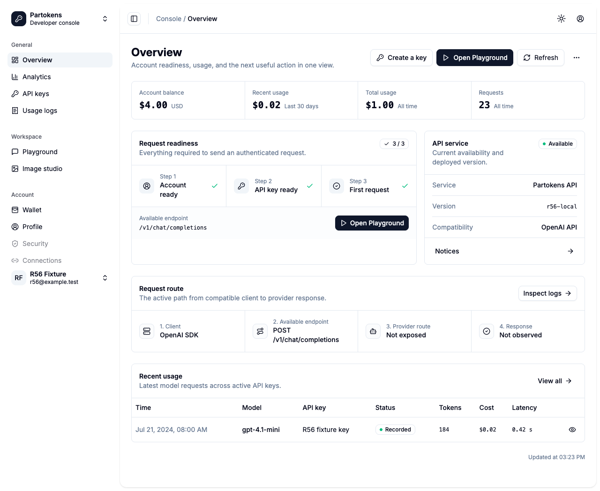
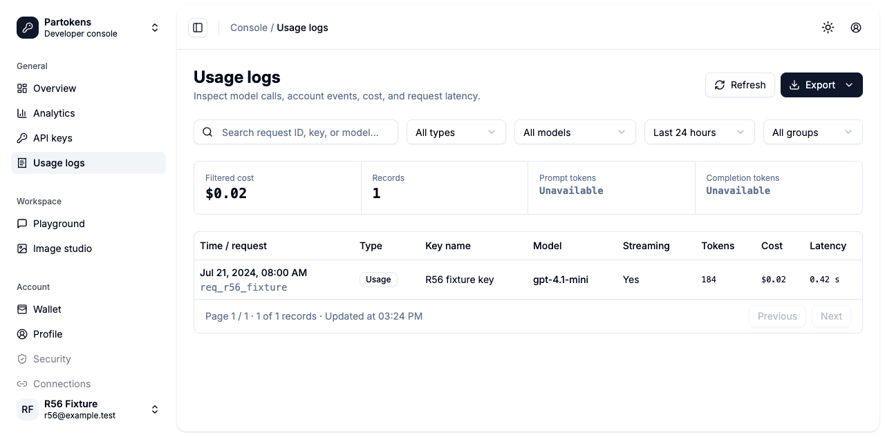
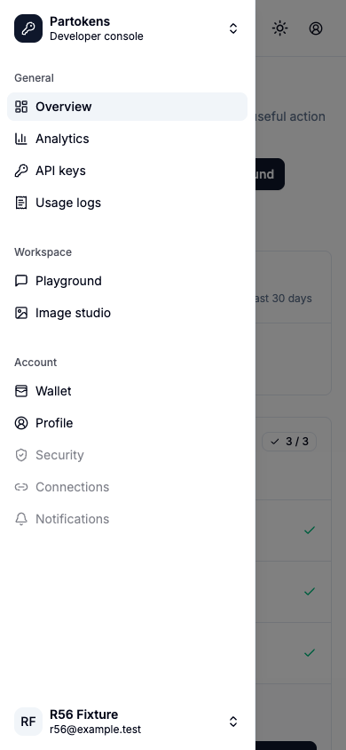

# R56 Console Canonical Cutover

| Field | Result |
| --- | --- |
| Date | 2026-07-28 |
| Scope | Local development and testing only |
| Canonical surface | `/$locale/console/*` |
| Deployment | Not executed |
| Decision | **PASSED** |

## Result

R56 is complete. The canonical Overview, Analytics, API Keys, and Usage Logs routes now render the Foundation UI inside the Foundation shell. Navigation, page actions, authentication return paths, and internal links use canonical `/console/*` URLs. The former `/console-foundation/*` paths remain compatibility entries and replace-navigate to the matching canonical route while preserving locale and search parameters.

No staging or production requests, account validation, resource mutations, release packaging, or deployment actions were performed.

## Route Cutover

| Compatibility entry | Canonical destination |
| --- | --- |
| `/$locale/console-foundation` | `/$locale/console/overview` |
| `/$locale/console-foundation/overview` | `/$locale/console/overview` |
| `/$locale/console-foundation/analytics` | `/$locale/console/analytics` |
| `/$locale/console-foundation/keys` | `/$locale/console/keys` |
| `/$locale/console-foundation/logs` | `/$locale/console/usage-logs` |

The canonical console shell also owns Playground, Image Studio, Wallet, and Profile navigation. Each route now receives the correct active item and header label; the standalone public TopNav is not rendered around console routes.

## Authentication And Permission Contracts

| Contract | Verification |
| --- | --- |
| Anonymous direct access | Redirects to localized sign-in with the full canonical path in `redirect` |
| Password, OAuth, and 2FA success | Ordinary users land on `/$locale/console/overview` by default |
| Refresh recovery | Canonical direct visits recover through the R55 refresh bundle contract |
| Administrator role | Role `>= 10` still leaves the localized console for `/channels` |
| HTTP 401 | One refresh path retries protected requests; invalid sessions return to localized sign-in |
| HTTP 403 | Remains feature-local, does not refresh, and does not expose backend response data |
| Owner/self scope | Keys use owner token APIs; analytics and logs use self-scoped endpoints |
| Sensitive data | Full keys exist only in transient reveal state; raw log content and metadata are not rendered or persisted |

The defensive restricted-response tests remain in the suite, but restricted-account acceptance was not reintroduced as a development Gate.

## Automated Verification

| Command | Final result |
| --- | --- |
| `bun run typecheck` | Passed: Web and Docs; 98 localized docs pages generated, 0 updated |
| `bun run test` | Passed: Web 11 files / 82 tests; Docs 1 file / 3 tests |
| `bun run build` | Passed: Web build and Docs build; 102 static docs pages |
| `bun run test:e2e` | **Passed: Chromium 96/96, 1 worker, 0 retry, 2.7 minutes** |

Coverage includes canonical direct access and reload, compatibility redirects with retained search, sidebar navigation, all seven locales, 1440/390/320 responsive layouts, light/dark themes, mobile sidebar Escape/navigation behavior, keyboard focus restoration, empty/loading/partial/contract states, and the R55 authentication/permission matrix.

The first two full E2E runs each finished 95/96 on the same existing Usage Logs focus race: the test moved focus immediately after closing the Export menu while the menu's asynchronous focus restoration was still pending. The test now waits for focus to settle on the Export trigger before moving to the detail trigger. The corrected case passed 5/5 with `--repeat-each=5`; the subsequent complete run passed 96/96 with no retry.

## Browser Dogfood

An isolated `agent-browser` session exercised `http://127.0.0.1:4174` with local, fictional response fixtures only.

| Check | Result |
| --- | --- |
| Overview -> Analytics -> Keys -> Usage Logs sidebar navigation | Passed; every visible URL remained canonical |
| French legacy Logs entry with `?compat=browser` | Passed; redirected to `/fr/console/usage-logs?compat=browser` |
| 390px mobile sidebar | Passed; canonical links visible, no horizontal overflow |
| Mobile Escape focus restoration | Passed after the component's defined restoration delay |
| Browser errors | None |
| Dogfood issues | 0 critical, 0 high, 0 medium, 0 low |

Desktop Overview: 

Desktop Usage Logs: 

Mobile navigation: 

## Changed Surface

- `apps/web/src/router.tsx`: canonical Foundation page ownership and compatibility redirects.
- `apps/web/src/components/console-foundation/console-shell.tsx`: canonical navigation, route-aware active state, and canonical account/workspace links.
- `apps/web/src/pages/console-foundation-page.tsx`: canonical Overview actions and Logs links.
- `apps/web/src/pages/auth-pages.tsx`: canonical ordinary-user default destination.
- `apps/web/src/lib/routes.ts`: shared canonical console page-segment mapping.
- Related unit, critical-flow, Foundation contract, and visual E2E coverage.

## Gate

**Canonical Console Cutover: PASSED.** The canonical four pages use Foundation UI, old Foundation entries remain compatible, authentication and permission contracts have no detected regression, and the full local test matrix passes. Production deployment remains a future release task and did not block or enter this R56 scope.
