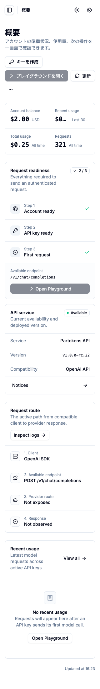
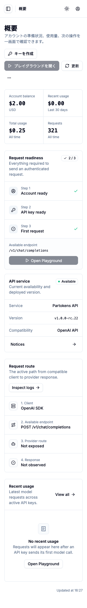

# R58 Canonical Console Hardening

| Field | Result |
| --- | --- |
| Date | 2026-07-28 |
| Scope | Local development and testing only |
| Canonical surface | `/$locale/console/*` |
| Deployment | Not executed |
| Decision | **PASSED** |

## Result

R58 is complete. Legacy-only CSS, translation entries, and duplicate test output references were removed without deleting shared Wallet, Profile, Playground, or Studio styles. A source-level guard now rejects new `/console-foundation` main-path references, every Console leaf is route-lazy, query/error/refresh conventions are shared, and the R55-R57 authentication and data-protection contracts pass the complete local suite.

One low-severity 320px truncation issue was found during browser dogfood, fixed, and covered by Chromium. There are no open browser findings.

No staging or production deployment, release packaging, real production-user acceptance, dual-account validation, administrator acceptance, or account/resource mutation was performed. Browser QA used fictional local response fixtures; environment-facing responses were not used as acceptance evidence.

## Legacy Cleanup

- Removed unconsumed Legacy Console shell, page, table, drawer, navigation, and mobile CSS selectors from `apps/web/src/styles.css`.
- Retained selectors still consumed by Wallet, Profile, Playground, Studio, shared forms, and shared shell components.
- Removed 64 Legacy-only translation keys, representing 325 obsolete dictionary entries across the seven locale dictionaries, while retaining exact dictionary parity.
- Updated user-facing content that still said “console foundation” to “unified Console”.
- Removed the duplicate Playwright `.last-run 2.json` artifact and redirected Console screenshot output to the R58 directory.
- Rechecked current top-level CSS selectors against source consumers; the cleanup heuristic found no remaining unconsumed selector in the inspected scope.

## Canonical Regression Guard

`apps/web/src/lib/canonical-console-hardening.test.ts` recursively scans Web source and E2E TypeScript files. The exact `/console-foundation` path is permitted only in `e2e/console.spec.ts`, where compatibility redirects are tested. Runtime routing keeps only the segment literal `console-foundation` in the centralized route map.

Final source scan result:

- Compatibility E2E: six exact path references, all redirect assertions or browser-error coverage.
- Route map: one compatibility segment literal.
- Production links, primary routes, page modules, tests, and content: zero exact legacy main-path references.

The same static suite verifies that Overview, Analytics, API Keys, Usage Logs, Wallet, and Profile are loaded with `lazyRouteComponent`; Playground and Studio retain their existing lazy routes. It also prevents Overview from importing the heavy Usage Logs page and guards against removed Legacy shell selectors.

## Bundle Hardening

The final production build emitted separate Console leaf chunks:

| Surface | Async chunk size | Gzip |
| --- | ---: | ---: |
| Usage Logs | 25.0 kB | 7.7 kB |
| Overview | 28.2 kB | 7.7 kB |
| Analytics | 33.9 kB | 8.2-8.7 kB |
| API Keys | 40.0 kB | 11.8 kB |

The main entry remains 317.3 kB / 91.2 kB gzip and the shared application chunk remains 505.4 kB / 152.0 kB gzip. The four heavy Console pages are not all present in the initial route bundle. Authentication bootstrap remains in the shared shell, so direct visits and full refreshes can restore the session before resolving the requested lazy leaf.

Usage-log parsing/redaction moved to `apps/web/src/lib/console-usage-contract.ts`, allowing Overview to share the safe contract without importing the Usage Logs UI module.

## Query And Error Contract

`apps/web/src/lib/console-query.ts` defines one `['console']` root and stable page/resource keys for Overview, Analytics, API Keys, and Usage Logs. Refresh helpers refetch only active queries; invalidation helpers target explicit canonical roots. API Key mutations now invalidate the actual Overview token key and no longer reference stale `['console', 'tokens']` or `['tokens']` keys.

Errors are projected into four safe categories:

| Category | Behavior |
| --- | --- |
| Authentication / 401 | Existing API client performs one refresh and one retry; unrecoverable sessions return to localized sign-in. |
| Authorization / 403 | Remains feature-local, preserves the session, and does not refresh. |
| Contract | Renders a fixed incomplete-contract message without projecting raw payload data. |
| Availability | Renders a fixed page-specific fallback without projecting backend details. |

API Keys continue to use owner token routes. Analytics and Usage Logs continue to use self-scoped routes. Redaction, response projection, and persistence checks confirm that key secrets, bearer values, credential-shaped filters, raw log metadata, and backend error payloads do not enter rendered UI or browser storage.

## Browser QA

An isolated `agent-browser` pass exercised the canonical Console with local fictional fixtures.

| Check | Result |
| --- | --- |
| Four pages at 1440px | Passed; correct canonical heading/navigation, no horizontal overflow, no page errors. |
| Four pages at 320px | Passed after ISSUE-001 fix; stable layout and `scrollWidth === clientWidth`. |
| Usage Logs and mobile navigation at 390px | Passed; sidebar order, Escape close, and delayed trigger-focus restoration verified. |
| Accessible names | Passed for sidebar, theme, account, page actions, search fields, filters, tables/regions, and pagination. |
| Keyboard order | Passed; sidebar trigger, theme, account, and page actions follow the visible order; disabled actions are skipped. |
| Locale and search | Passed for English, French, and Japanese browser probes; full reload retained the complete canonical path and query. |
| Console/page errors | None; only expected local development server informational messages were present. |

Primary evidence:

- `screenshots/overview-1440.png`
- `screenshots/analytics-1440.png`
- `screenshots/api-keys-1440.png`
- `screenshots/usage-logs-1440.png`
- `screenshots/navigation-390.png`
- `screenshots/overview-320-fixed.png`

## Browser Findings

### ISSUE-001: Overview usage metric text truncates at 320px

| Field | Value |
| --- | --- |
| Severity | Low |
| Category | Visual / responsive layout |
| URL | `/ja/console/overview?range=30d&request_id=keyboard-check` |
| Repro video | N/A (static issue) |
| Status | Fixed and verified |

At a 320 x 800 viewport, the Recent usage value and its Last 30 days qualifier are truncated with ellipses. The metric row should preserve the complete value and qualifier by wrapping them within the stable two-column mobile layout.

1. Open the canonical Overview route at a 320px viewport with local fictional API fixtures.
2. Observe the Recent usage metric in the first summary grid.
3. The main value renders as `$0...` and the qualifier as `Last 30 ...`.

The metric row now stacks each value and qualifier below 360px and returns to an inline layout at wider viewports. The 320px Chromium assertion verifies that `Last 30 days` is visible without internal clipping, and the browser recheck confirmed `scrollWidth === clientWidth === 320`.

## Automated Verification

| Command | Final result |
| --- | --- |
| `bun run typecheck` | Passed: Web and Docs; 98 localized documentation pages generated, 0 updated. |
| `bun run test` | Passed: Web 13 files / 93 tests; Docs 1 file / 3 tests. |
| `bun run build` | Passed: Web production bundle and Docs production build; 102 static Docs pages. |
| `bun run test:e2e` | **Passed: Chromium 98/98, 1 worker, 0 retry, 2.9 minutes.** |
| `git diff --check` | Passed. |

Chromium coverage includes canonical direct access, four-page locale/search retention across full refresh, all compatibility redirects, seven authentication locales, 1440/390/320 responsive states, light/dark themes, keyboard sidebar control, Escape/navigation focus restoration, accessible names, loading/empty/partial/contract states, API key lifecycle, Usage Logs redaction, 401 refresh, 403 isolation, owner/self scope, administrator routing, Playground/Studio refresh behavior, and sensitive-data persistence checks.

## Gate

**Canonical Console Hardening: PASSED.** Legacy residue was safely reduced, canonical paths have a static anti-regression boundary, Console leaves are split into independent route chunks, query/error/refresh conventions are unified, the 320px regression found during dogfood is closed, and all requested local verification passes. Deployment and real-user role acceptance remain intentionally out of scope.
